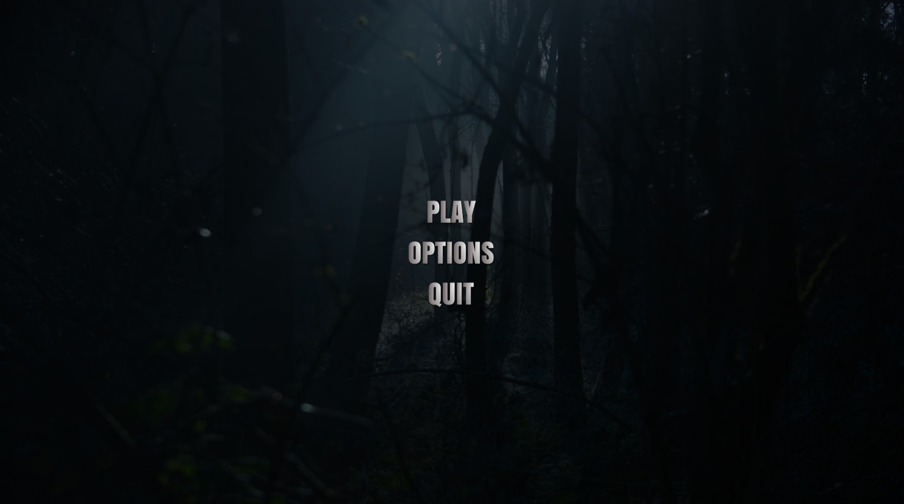
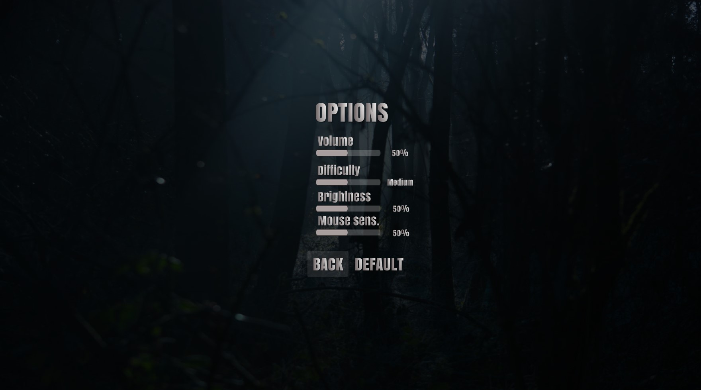
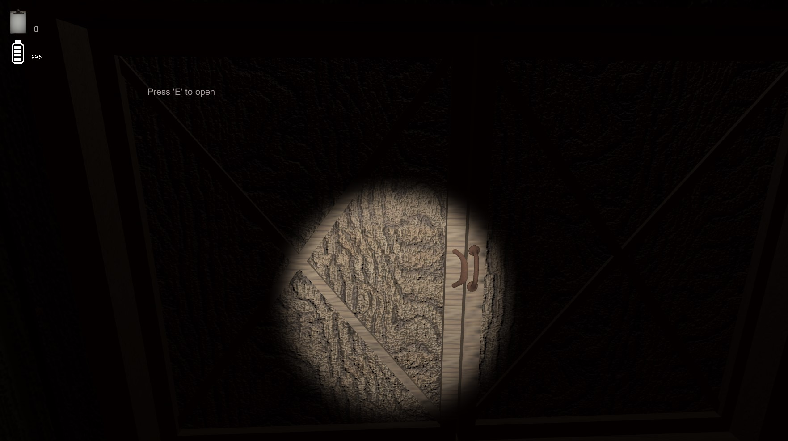
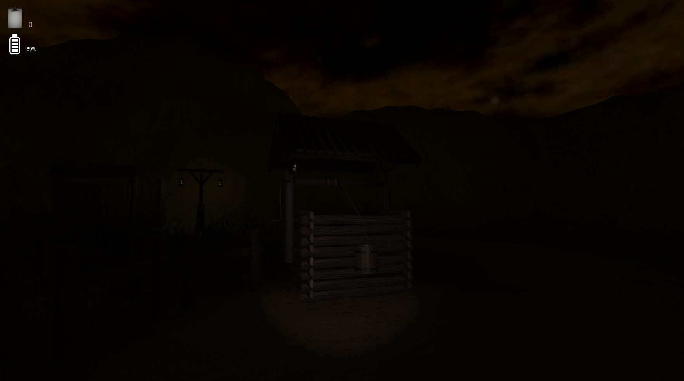
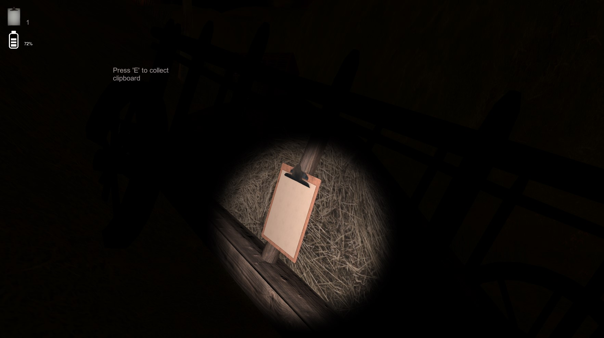
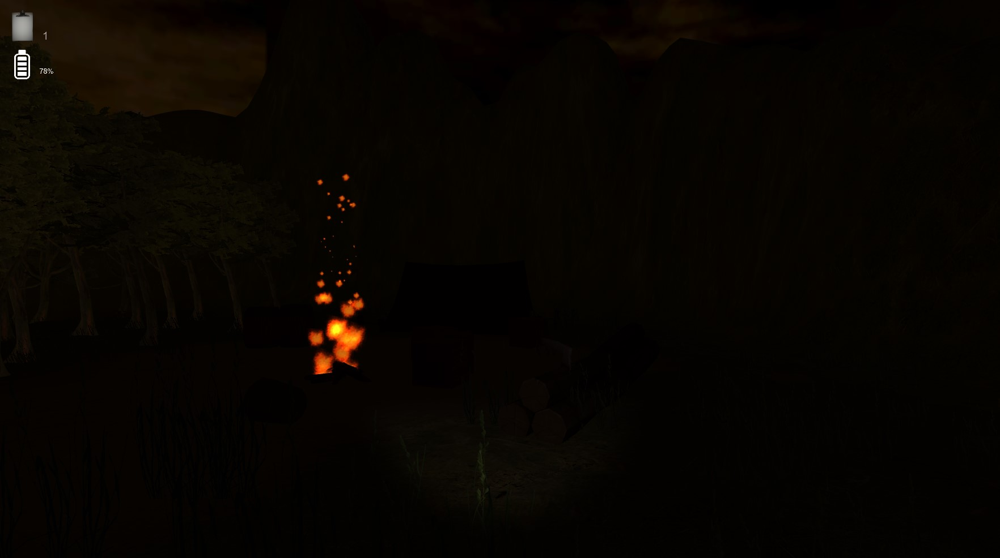
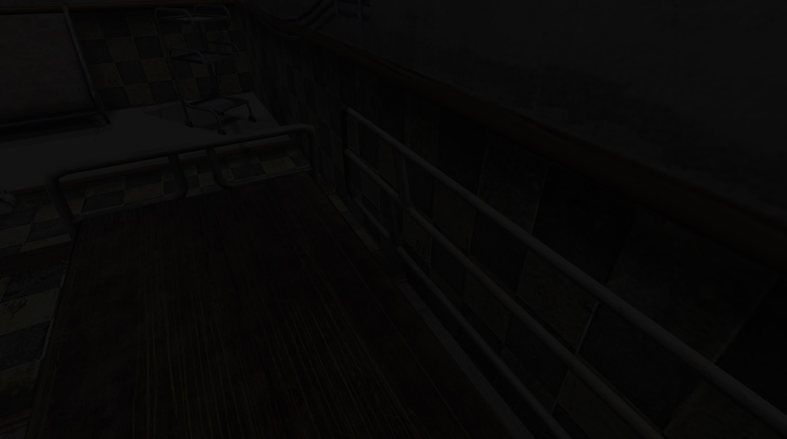

# Unity horror 
A horror-like game created with c# in unity. The whole game is based on an idea of collecting notes to get into the next chapter of the story. 
***
## Background story
You wake up in the middle of the night in an old abandoned wodden village. You have only small fleshlight with limmited ammount of baterry. Be careful to not run out of your power because without a light it's difficult to find notes. In order to get out from this place you have to collect all 8 notes and then open a gate.
***
## Here are some screenshots and features from the game:
### Starting menu
Menu contains some options you can personalize before starting a game (runtime you can access options panel by pressing 'esc'). 
 
### In game
You are equipped with fleshlight which you can turn on/off by 'rpm'. Difficulty from starting menu influences battery capacity, the higher difficulty the battery runs out faster. You have to find 5 clipboards scattered around the map. Collect them by pressign 'E' key.
   
 
### Animations, cut scenes, sounds and soundtrack
When you complete your quest you can procced to open a gate which activates a cut scene. Overall there are some animations and a particle system created by myself. In game you can hear soundtrack (menu, cut scene), and several sounds in forest, or on a campsite.

***
## About
Game was created by myself using knowledge accquired from books and internet before. I do not plan to improve this project because it was created in addition to test my skills and see what are my abilities.
***
## GAME DOWNLOAD LINK (zipped folder)
Click the link and then click the button download: 
https://drive.google.com/file/d/1qK4Xcs3QREl0Q9PScNXZFGUeewHhtWge/view?usp=sharing
